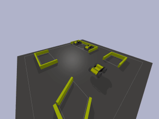
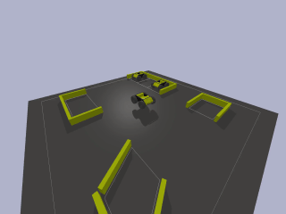
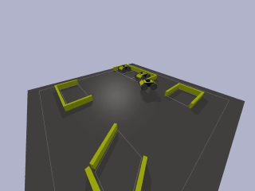

# RL parking

基于DQN算法实现模拟小车倒车入库，强化学习算法使用stable-baselines3实现，小车和倒车环境基于pybullet实现。


## Tasks

### 1. 垂直倒车入库

- 目标：小车从车位前出发，车头方向与车位方向对齐，倒车过程中不能碰撞墙壁，实现垂直倒车入库。
- 效果：




### 2. 侧方位-垂直倒车入库

- 目标：小车从 [0, 0] 出发，车头方向与车位垂直，倒车过程中不能碰撞墙壁，实现倒车入库。
- 效果：


### 3. 侧方位-垂直倒车入库（车位旁边有小车）

- 目标：小车从 [0, 0] 出发，车头方向与车位垂直，倒车过程中不能碰撞墙壁和车位旁的小车，实现倒车入库。
- 效果：


### 4. 侧方位-平行倒车入库

- 目标：小车从 [0, 0] 出发，车头方向与车位平行，倒车过程中不能碰撞墙壁，实现倒车入库。
- 效果：


### 5. 斜方位-60度倒车入库

- 目标：小车从 [0, 0] 出发，车头方向与车位成 60 度角，倒车过程中不能碰撞墙壁，实现倒车入库。
- 效果：




### 6. 任意位置出发倒车入库（车位旁边有小车）

- 目标：小车从任意点出发，车头方向随机，倒车过程中不能碰撞墙壁和车位旁的小车，实现倒车入库。
- 效果：




## RL Definition

### 1. Observation

我们定义环境中心点为 [0, 0]，使用pybullet实时获取小车的坐标、速度和方向等信息，作为小车当前的状态。

状态是一个6维向量，分别为小车的x坐标、y坐标、x方向线速度、y方向线速度、与x方向夹角余弦值、与y方向夹角余弦值。

$$
\text{observation = [position\_x, position\_y, velocity\_x, velocity\_y, cos(angle), sin(angle)]}
$$


### 2. Action

小车可以执行4种动作：前进、后退、左转、右转，使用pybullet在环境中模拟小车的运动。


### 3. Reward

对于大部分状态-动作对，我们定义如下 reward：
$$
\text{reward} = -\sqrt{\text{observation} - \text{goal}}
$$
当小车碰撞到墙壁或其他小车时，定义 reward = -500。


### 4. Episode

我们设定回合长度为500，但当小车碰撞到墙壁或其他小车时，终止回合。


## How to install

- 克隆本项目

```shell
git clone https://github.com/RyanLiu112/RL_parking
```

- 进入项目目录

```shell
cd RL_parking
```

- 安装停车环境（会同时安装gym、pybullet、stable-baselines3、torch、moviepy等第三方库）

```shell
pip install -e parking_env
```


## How to train

### 1. 使用 DQN 算法训练

在算法方面，我们选择了适用于离散动作空间的经典算法——DQN (Deep Q Network)。DQN是一种基于Q-learning的off-policy强化学习算法，使用replay buffer存放智能体在环境中探索得到的经验。

我们使用强化学习领域目前最为优秀的开源库stable-baselines3进行训练，10行代码即可训练强化学习智能体。同时，stable-baselines3支持向量化环境，训练速度较快，使用cpu即可快速完成训练。其中，任务1-5训练了2百万步，任务6训练了5百万步。

通过训练过程可以发现，前期小车有较高的探索概率，在环境中不断试错，根据试错经验进行学习，后期小车探索率降低，能够以较高的成功率完成停车过程。任务6在2百万步后，小车基本上达到了从任意点出发都可以停到目标车位的效果。

#### 各任务训练命令

- 任务1：垂直倒车入库

```shell
python dqn_agent.py --mode=1
```

- 任务2：侧方位-垂直倒车入库

```shell
python dqn_agent.py --mode=2
```

- 任务3：侧方位-垂直倒车入库（车位旁边有小车）

```shell
python dqn_agent.py --mode=3
```

- 任务4：侧方位-平行倒车入库

```shell
python dqn_agent.py --mode=4
```

- 任务5：斜方位-60度倒车入库

```shell
python dqn_agent.py --mode=5
```

- 任务6：任意位置出发倒车入库（车位旁边有小车）

```shell
python dgn_agent.py --mode=6
```


### 2. 使用 SAC 和 HER 算法训练（使用 highway-env 环境）

```shell
python sac_her_agent.py
```


## How to evaluate

```shell
# 需指定 mode 和 ckpt_path
python evaluate.py --mode=mode --ckpt_path=ckpt_path
```


## How to play in the environment

```shell
python play.py
```


## How to render videos

### 1. 小车测试视频

```shell
# 需指定 mode 和 ckpt_path
python render_video.py --mode=mode --ckpt_path=ckpt_path
```


### 2. 小车训练视频

```shell
# 需指定 mode 和 ckpt_path
python render_training_video.py --mode=mode --ckpt_path=ckpt_path
```


### 3. 环境视频

```shell
# 需指定 mode
python render_env_video.py --mode=mode
```


## References

[1] Volodymyr Mnih, Koray Kavukcuoglu, David Silver, Alex Graves, Ioannis Antonoglou, Daan Wierstra, and Martin Riedmiller. Playing atari with deep reinforcement learning. arXiv preprint arXiv:1312.5602, 2013.

[2] Antonin Raffin, Ashley Hill, Adam Gleave, Anssi Kanervisto, Maximilian Ernestus, and Noah Dormann. Stable-baselines3: Reliable reinforcement learning implementations. Journal of Machine Learning Research, 2021.

[3] Erwin Coumans and Yunfei Bai. Pybullet, a python module for physics simulation for games, robotics and machine learning. http://pybullet.org, 2016–2021.

[4] Ajasra Gupta, Vikhyath Venkatraman, Prince Kumar Gond, Amarjeet Keshri, Lokesh Krishna, and Niranth Sai. gym-carpark. https://github.com/Robotics-Club-IIT-BHU/gym-carpark, 2020.

[5] Edouard Leurent. An environment for autonomous driving decision-making. https://github.com/eleurent/highway-env, 2018.
